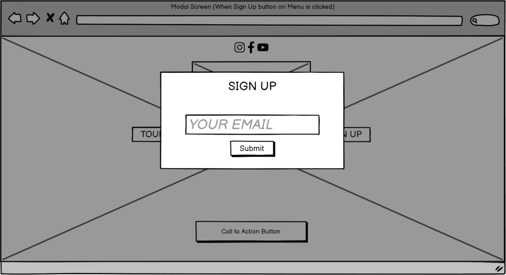
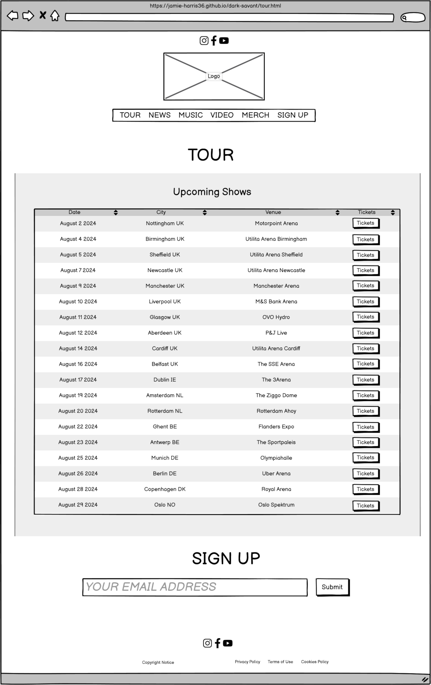
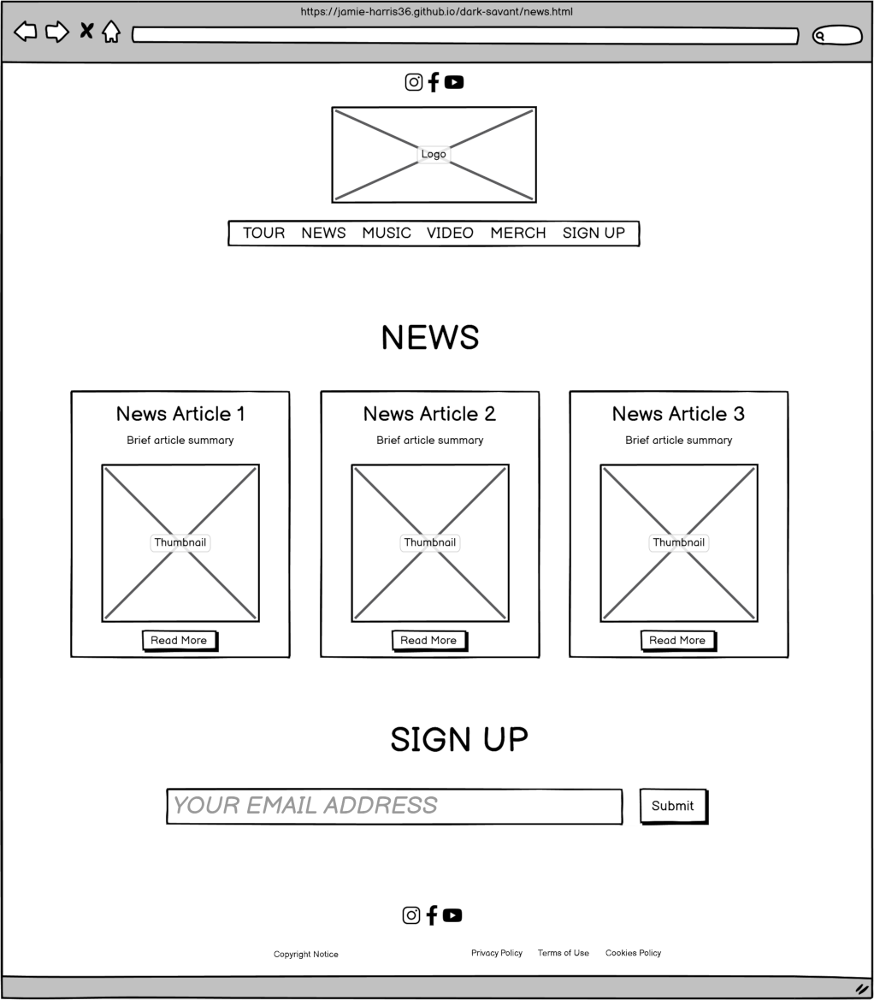
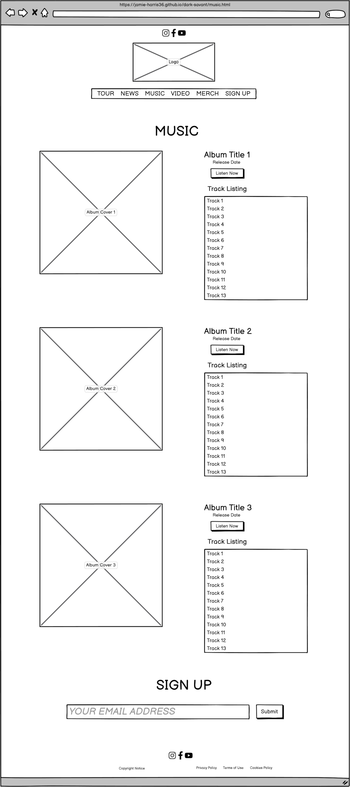
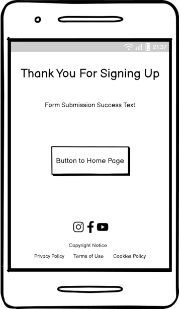
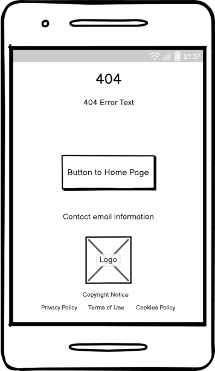

# Dark Savant Website

#### By Jamie Harris

[Click here to view the live web application](https://jamie-harris36.github.io/dark-savant/)

This is the documentation for Dark Savant's new website. It has been built using HTML5, CSS3, Bootstrap and Javascript as part of Code Institute's Diploma in Web Application Development Course.

## Project Development & Planning

Throughout the development of this project, I followed the principles of User Experience (UX). This included the five elements of
UX design:

1. Strategy
2. Scope
3. Structure
4. Skeleton
5. Surface

My aim was to ensure the website was easy to use and responsive, as well as fulfilling the needs of the user.

### Project Goals

#### **Project Purpose**

Dark Savant, a Nottingham based metal band, need an updated and redesigned website to promote the band's latest tour dates, news and merchandise.

#### **Client Background**

Dark Savant is a Doom Metal band based in Nottingham, UK. The band play arena shows all over the UK and Europe. They also have three studio albums and sell a wide range of merchandise and apparel, including T-shirts, hoodies, hats and other accessories. The music that the band play range from hard rock, heavy metal and also with a hint of soft ballads.

#### **Client Goals**

- To sell tickets for their arena shows to their fans.
- To sell band merchandise to their fans, which will also raise brand awareness.
- To prompt fans and potential fans to listen to their music on streaming services.
- To share information and latest news about the band to their fans and potential fans.
- To invite people to sign up for email updates, where the band can further promote news, shows, releases and merchandise.
- To attract new fans.

#### **User Goals**

The website will be for various types of users with different motivations:

- Fans that want to know if the band will be playing a show in their city.
- Fans that want to buy a ticket for a show.
- Fans that want to listen to official music releases.
- Fans that want to buy official band merchandise.
- Fans that want to read the latest band news.
- Fans that want to keep up to date by signing up to the band's email list.

### Design, Layout & Structure

#### **Wireframes**

Home Page

Modals

Tour Page

News Page

Music Page

Video Page

Merch Page

News Article Pages

Legal Pages

Thank You Page

404 Error Page

#### **Structure**

The site has a simple structure, made up of 14 pages:

- Homepage - The main hub page, consisting of a summary of each individual section.
- Tour Page - More detailed information about the band's tour dates and a way for fans to buy tickets.
- News Page - More detailed information about the band's latest news, including the following articles:
    - New Album - Information about the latest album release, and a way to listen on streaming services.
    - Tour Announced - Information about the latest European tour, and more information on how to book tickets.
    - New Merch - Information about the latest apparel released and information on how to buy from the shop.
- Music Page - Information about the studio album releases and links to listen to them on streaming services.
- Video Page - A page containing embedded lyric videos that are hosted on YouTube.
- Merch Page - A page containing merch item listings, the prices of each item and links to buy them on an external website.
- There are also 5 additional sub pages.
    - Privacy Policy - Information about the privacy policy.
    - Terms of Use - Information about the terms of use.
    - Cookies Policy - Information about the cookies policy.
    - Thank You Page - Where the user is directed to when they use the sign up form.
    - 404 Error Page - Where the user is directed when they land on a non-existant page.

The site has a nav menu at the top of the page, containing social media icons. These icons link to the band's official social media pages. This menu also appears in the site's footer. The site also has a main nav menu, contained underneath the band logo on desktop and tablet view, however on mobile view, the main nav menu and social media menu appear only when the menu toggle icon(three horizontal lines located on the top right hand corner of the page) is clicked. When the menu toggle icon is clicked, the menus will appear over a plain black background which covers the entire screen, and will only go back to normal when the menu toggle icon (now a cross shaped icon) is clicked again.

On the homepage, there is a header image that covers the entire screen, also known as 'above the fold' and in order to see any further content, the user is required to scroll down. The homepage is the only page where this header image is seen. On every other page, the content is positioned directly underneath the main nav menu.

There is also a footer on every page, containing the social media nav menu, links to legal pages, and a copyright notice.

#### **Colours**

I have used the following colours as part of this website's colour pallette:

- #a180a9
- #6f279c
- #49328a
- #343a40
- #a1a1a1
- #000000
- #eeeeee
- #ffffff

#### **Fonts**

I imported Google Fonts and used Alegreya (with a fallback of Sans Serif) for the main body font. I feel this goes well with the dark theme the band is looking for.

## Technologies Used

### Languages Used

- HTML
- CSS
- Javascript

### Tools Used

- Git
    - Used for version control via GitPod
- GitHub
    - Used to store the project code after being created in GitPod.
- GitPod
    - Used to create, edit and preview the project code.
- Bootstrap 4.5.2
    - Used to help with the responsiveness of the site and to add styling to certain areas.
- Google Fonts
    - Used to select and import the fonts to the project.
- Font Awesome
    - Used to add the social media icons.
- TinyPNG
    - Used to further optimise images and reduce the file size.
- GIMP
    - Used to crop, resize and adjust images for optimisation.
- Favicon.io
    - Used to create and add the favicon icon to the browser tab.

## Features

### Whole Site

#### **Social Media Menu**

- Appears on all pages, apart from the 404 and Thank You pages.
- Contains links to official social media pages.
- The menu appears on desktop screens, and is shown after the menu toggle icon is clicked on smaller screens.

#### **Header Logo**

- Appears on all pages apart from the 404 and Thank You pages.
- Links to the home page.
- The logo is responsive and reduces in size on smaller screens.

#### **Main Nav Menu**

- Appears on all pages, apart from the 404 and Thank You pages.
- Contains links to all the other main pages.
- The navbar is fully responsive, and shows a toggle icon on smaller screens.
- There is a hover effect on other nav links.
- Sign Up link opens up modal that appears over the page that contains an email sign up form.

#### **Sign Up Form**

- Appears on all pages, apart from legal pages, 404 and Thank You pages.
- Responsive, reduces in size on smaller screens.
- Email input field is required and must be filled in in order to be submitted.

#### **Footer**

- The footer appears on all pages.
- The footer is responsive and as the screen gets smaller, so does the font size and the spacing.
- The footer contains links to social media pages. The only exception is that this doesn't appear on the 404 page.

#### **Favicon**

- The Favicon is seen on the browser tab when any page is open. It displays the band logo. It helps the website to stand out against other websites that might not have a Favicon, or have a different Favicon.

### Home Page

#### **Header Call to Action**

- Appears on the Home Page.
- Links to external YouTube video
- Responsive in size and reduces size on smaller screens.

#### **Hero**

- The home page contains a hero image that covers the entire 'above the fold' section.
- Doesn't appear on any other page.
- The image is positioned underneath the social media menu, main nav menu, logo and call to action.

#### **Tour Section**

- The Tour section gives an overview of the first five shows on the tour, using a Bootstrap table.
- There are buttons to buy tickets for each show.
- There is a call to action button that will take the user to the TOUR page, to see more shows.
- The table is responsive, the button and the text reduce size on smaller screens.

#### **News Section**

- There are three news items on a row, each containing a heading, a thumbnail, a brief description and a button to read more.
- These buttons takes the user to the relevant news article.
- The display is responsive, on smaller screens there is one news item per row.

#### **Music Section**

- There are three albums displayed in a row, containing the album cover images, album titles and a button to listen now.
- The view is responsive, on smaller screens the albums are stacked on top of one another.

#### **VIdeo Section**

- An embedded YouTube video player is displayed, with three thumbnail images underneath.
- The video player is designed not to autoplay so the user isn't surprised by sudden video or audio.
- When a thumbnail image is clicked, the relevant video will autoplay in the video player.
- The video player and thumbnails are responsive and are stacked on top of one another on smaller screens.

#### **Merch Section**

- There are three merch items displayed on a row, each with a thumbnail image, heading and button to buy the item.
- The view is responsive, on smaller screens the merch items are stacked on top of one another.

### Tour Page

- The tour page is an expanded version of the tour section located on the home page.
- Instead of 5 shows that are displayed on the home page, there are 19.
- The table is responsive, just like on the home page.

### News Page

- There are three news items on a row, each containing a heading, a thumbnail, a brief description and a button to read more.
- These buttons takes the user to the relevant news article.
- The display is responsive, on smaller screens there is one news item per row.

### Music Page

- The music page contains information about the three studio albums, divided into three sections.
- Each album section contains information about the album title, release date, a button to listen to the album on streaming services, and the track listing.
- The page is responsive for smaller screens.

### Video Page

- An embedded YouTube video player is displayed, with three thumbnail images underneath.
- The video player is designed not to autoplay so the user isn't surprised by sudden video or audio.
- When a thumbnail image is clicked, the relevant video will autoplay in the video player.
- The video player and thumbnails are responsive and are stacked on top of one another on smaller screens.

### Merch Page

- The merch page contains 8 merch items, 3 per row on desktop view. 
- Each item contains a thumbnail image, which zooms in when hovered over, as well as the item name, the price of the item, and a button taking the user to an external page to buy the item.
- The view is responsive, with the items stacking on top of one another on smaller screens.

### Content Pages

#### **New Album**

- This page contains content, talking about the release of the new album. 
- The article also contains a track listing and a large version of the thumbnail image underneath.
- Underneath the image there is a section for 'More News' containing the other two news items on a single row, for easy navigation between articles.
- This page is responsive, with the content fitting within the width of the page, even on smaller screens. On smaller screens, the related news items section are positioned one on top of another.

#### **Tour Announced**

- This page contains content, talking about the new tour.
- There is a call to action, taking the user to the TOUR page, in order to prompt them to buy tickets.
- The article also contains a list of all the shows that will be played, with a large thumbnail image underneath.
- Underneath the image there is a section for 'More News' containing the other two news items on a single row, for easy navigation between articles.
- This page is responsive, with the content fitting within the width of the page, even on smaller screens. On smaller screens, the related news items section are positioned one on top of another.

#### **New Merch Released**

- This page contains content, talking about the new merch that has been released.
- In this article, the user is told they can buy merch at any of the shows, with a link provided to the TOUR page so the user can buy tickets.
- Underneath the text, there is a large thumbnail image. This image links to the MERCH page, so the user can further look at the merch items for sale.
- Underneath the image there is a section for 'More News' containing the other two news items on a single row, for easy navigation between articles.
- This page is responsive, with the content fitting within the width of the page, even on smaller screens. On smaller screens, the related news items section are positioned one on top of another.

### Legal Pages

#### **Privacy Policy**

- A simple web page showing a generic Privacy Policy template.

#### **Terms of Use**

- A simple web page showing a generic Terms of Use template.

#### **Cookies Policy**

- A simple web page showing a generic Cookies Policy template.

### Other Pages

#### **404 Page**

- A simple web page that appears when the user lands on a non-existant page.
- Improves UX, by having a branded 404 error page, it makes the user know they're still on the same website, as opposed to landing on a generic 404 page, where it will appear the user has navigated away from the website completely.
- Contains a button linking back to the home page, so the user doesn't have to click the 'back' button. 

#### **Thank You Page**

- A simple web page that appears when the user submits a form.
- Improves UX, tells the user that the form was sent correctly.
- Contains a link to the home page, so the user doesn't have to click the 'back' button, improving UX.

## Testing & Bugs

### Responsiveness

The site was tested on the following devices:

- HP Laptop
- Samsung Galaxy A5
- Google Chrome Developer Tools - simulator for many different devices and varying screen sizes, as well as the adjustable sizing options.

### Clickable Links

- Each clickable link has been tested and made sure they go to the correct places. 
- Each external link opens up in a new tab so the user isn't directed away from the website.
- It should be noted that any external links to buy tickets, buy merch or listen to albums aren't real, as the tours, merch and albums are made up. The buttons to buy tickets, merch and stream albums direct the user to [Ticketmaster](https://www.ticketmaster.com/), [Merchbar](https://www.merchbar.com/), and [Spotify](https://open.spotify.com/) respectively.

### Email Form

- I tested the email form several times, using the Code Institute form dump page as a template, but made the mistake when I added my own Thank You page of keeping "POST METHOD". Once I changed to "GET METHOD" the form worked fine. 

### Video Player

- I tried to find a way to make the video player change the video source when the relevant thumbnail is clicked. I used a tutorial (mentioned below) and adapted the code. There was a lot of trial and error involved.

### Code Validators

I used the following code validators:

#### **HTML Validator**

#### **CSS Validator**

#### **Wave Accessibilty Tool**

## Deployment

### GitHub Pages

The site was deployed to GitHub Pages. The steps to deploy are as follows:

1. In the GitHub repository, navigate to the Settings tab.
2. From the left hand menu, select 'Pages'.
3. From the source, select 'Branch: main'.
4. Click 'Save'.
5. A live link will be displayed when published successfully.

The live link can be found here - https://jamie-harris36.github.io/dark-savant/

### Forking the GitHub Repository

You can fork the repository by taking the following steps:

1. Go to the GitHub repository.
2. Click on the 'Fork' button in the upper right hand corner.

### Cloning the GitHub Repository

You can clone the repository to use locally by following these steps:

1. Navigate to the GitHub Repository you want to clone
2. Click on the 'Code' drop down button
3. Click on HTTPS
4. Copy the repository link to the clipboard
5. Open your IDE of choice (git must be installed for the next steps)
6. Type git clone copied-git-url into the IDE terminal

The project will now be cloned locally for you to use.

## Credits

### Code

- JavaScript: I used various tutorials on Stack Overflow (mainly https://stackoverflow.com/questions/5235145/changing-source-on-html5-video-tag) to figure out how to change the YouTube video source by clicking the relevant thumbnail image. I used a lot of trial and error.
- Bootstrap: Bootstrap library that I used throughout the project for layout and responsiveness using the Bootstrap Grid System. I also used and adapted some code to create my modal.
- Favicon.io: Used to create the site Favicon and provided the code that's in the head of all pages.

### Content

- The text in the legal pages has been adapted and simplified from templates generated by https://www.privacypolicies.com/

### Media

#### **Videos**

- Videos are embedded from my YouTube channel https://www.youtube.com/@jaysavant/videos

#### **Photos**

- Home Page
    - Background image was found at https://pxhere.com/en/photo/1457103 then adapted by myself.
    - Images in each section of the Home Page are sourced from the following pages.
- News Page/Section
    - Tour Poster image was AI generated at https://deepai.org/machine-learning-model/text2img and was then adapted by myself.
- Music Page/Section
    - Album Covers were AI generated at https://deepai.org/machine-learning-model/text2img and were then adapted by myself.
- Video Page/Section
    - Video thumbnail images were taken from the videos on my YouTube channel https://www.youtube.com/@jaysavant/videos
- Merch Page/Section
    - Merch item images were generated at https://teespring.com/ using images I'd generated with AI or made myself.

### Acknowledgements

- My mentor [Gareth McGirr](https://github.com/Gareth-McGirr/) for his advice and guidance throughout the project.
- The whole team at [Code Institute](https://codeinstitute.net/) for teaching me their course content and providing support.